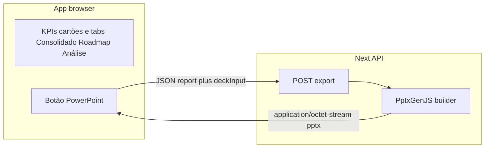
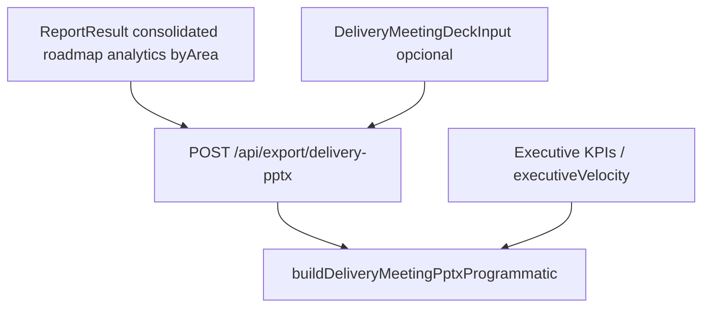

# Especificação: export PowerPoint com PptxGenJS (substitui o fluxo actual)

## Visão

Substituir o export actual baseado em **modelo `.pptx` no disco** + **pptx-automizer** por geração **programática** com **PptxGenJS**, mantendo os dados alinhados com o ecrã **e** com o conteúdo das **tabs da aplicação** (ver secção *Âmbito de conteúdo*), com validação do payload no servidor. O ficheiro `TEMPLEATE.pptx` e o modelo em `templates/` servem como **guia visual** e como **mapa semântico** de onde os dados entram no deck (ver *Paridade com o modelo e placeholders*); na v1 o PPTX **não** é lido em runtime para gerar o ficheiro.

## Contexto actual (a substituir)

- **UX**: botão em `app/home-client.tsx` (PowerPoint / modelo) invoca `lib/exportDeliveryMeetingPptx.ts`, que faz `POST` para `app/api/export/delivery-pptx/route.ts`.
- **Servidor**: `lib/server/deliveryMeetingTemplatePptx.ts` usa **pptx-automizer** sobre um `.pptx` em disco com marcadores `{{DF_*}}` / `{{DF_UI_*}}`; os valores preparados vivem em `lib/deliveryMeetingPptxData.ts`.
- **Dependências**: `pptx-automizer`, `jszip` (normalização de paths); **não** há `pptxgenjs` em `package.json` no estado descrito pelo plano.

## Objectivos

1. Gerar `.pptx` **apenas** com PptxGenJS (sem merge de XML do modelo em runtime).
2. **Estilo** alinhado ao template de referência (documentar tokens: verde de título, laranja TR, fundos, margens, tamanhos de texto) em código — layout com formas, texto e tabelas PptxGenJS.
3. **Dados** exclusivamente da aplicação: nenhum texto de negócio hardcoded excepto rótulos estáticos (ex.: “Delivery Follow-up”). Fontes:
   - **`ReportResult`** (WIQL): `consolidated`, `byArea`, `roadmap`, `analytics`, `filter`.
   - **KPIs do ecrã**: mesma lógica que `components/ExecutiveSummaryKpis.tsx` e `lib/ado/executiveVelocity.ts`.
   - **Tabelas manuais** `DeliveryMeetingDeckInput` (`pendencias`, `riscos`) em `lib/deliveryMeetingDeckInput.ts`, já enviadas no POST.

### Âmbito de conteúdo (além do visível no ecrã principal)

O export não se limita ao que está visível de imediato nos cartões / resumo executivo. Deve incluir, com dados do mesmo `ReportResult`, o equivalente ao que o utilizador vê nas **tabs**:

| Tab na app | Conteúdo mínimo no PPTX (dados de `report`) |
| ---------- | ------------------------------------------- |
| **Consolidado** | Visão consolidada além dos KPIs do topo: métricas por área (`byArea`), listas/recortes que hoje alimentam placeholders de “dashboard” e recap (ver mapa abaixo). |
| **Roadmap** | Itens de roadmap agrupados / tabulados (`roadmap`), com os mesmos limites de linha definidos na implementação (RNF2). |
| **Análise e métricas** | Bloco de analytics (`analytics`), throughput, lead/cycle time, WIP, mix por tipo, tags, notas, atrasos por área, etc., alinhado ao que a tab expõe. |

As **pendências** e **riscos** manuais continuam a vir de `deckInput`, como hoje.

### Paridade com o modelo e placeholders (`{{DF_*}}`)

O **template PowerPoint** usado pelo fluxo actual (ficheiro em `templates/` e referência `TEMPLEATE.pptx`) **já tem estrutura** (slides / caixas de texto) preparada para receber dados da aplicação via marcadores `{{DF_*}}` e `{{DF_UI_*}}`. O código que preenche esses tokens está centralizado em **`lib/deliveryMeetingPptxData.ts`** (`buildDeliveryMeetingPlaceholderMap`): cada chave (ex.: `DF_ANALYTICS_BLOCK`, `DF_ROADMAP_BODY`, `DF_DASHBOARD_BY_AREA_TSV`, `DF_UI_LAST_MEETING_PENDING`) corresponde a um bloco de conteúdo de negócio.

**Requisito de especificação:** a implementação com PptxGenJS deve cobrir **pelo menos o mesmo âmbito semântico de dados** que esse mapa + as tabs **Consolidado**, **Roadmap** e **Análise e métricas** — reorganizando em slides/tabelas próprios do builder, sem depender de merge XML do `.pptx` modelo. O modelo continua referência de **layout/tokens** e de **checklist de campos** a não esquecer na migração.

## Diagrama de fluxo de dados

### Diagrama conceptual (origens de dados)

## Requisitos funcionais

| ID  | Requisito |
| --- | --- |
| RF1 | Um único export PowerPoint (substitui o actual); mesmo gatilho UX ou rótulo actualizado (“PowerPoint” / “Exportar PPTX”). |
| RF2 | Payload mínimo: `{ report: ReportResult, deckInput?: DeliveryMeetingDeckInput }` com validação **Zod** como hoje. |
| RF3 | O `.pptx` inclui pelo menos: **capa** (projeto, org, recorte), **slide KPIs** (Total, Closed, Active, New, % conclusão, Velocity), **consolidado** (incl. **por área** / `report.byArea` e restantes agregados coerentes com a tab Consolidado), **roadmap** (`report.roadmap`, agrupamentos como na app), **análise e métricas** (`report.analytics` e métricas derivadas, p.ex. velocity via mesma lógica que o ecrã), **pendências** e **riscos** (tabelas a partir de `deckInput`). A lista de campos deve ser verificada contra `buildDeliveryMeetingPlaceholderMap` em `lib/deliveryMeetingPptxData.ts` para não regressão de âmbito face ao modelo com `{{DF_*}}`. |
| RF4 | Números e textos de negócio **só** de `report` / `deckInput`; reutilizar formatação existente onde fizer sentido (ex.: `lib/deliveryMeetingDeckInput.ts` para TSV ou equivalente em células). |
| RF5 | Execução **server-side** (Route Handler); resposta com `Content-Disposition: attachment`. |

## Requisitos não-funcionais

| ID   | Requisito |
| ---- | ----------- |
| RNF1 | `next build` estável após adicionar `pptxgenjs`; avaliar remoção de `pptx-automizer` e `jszip` quando o fluxo antigo deixar de existir. |
| RNF2 | Tamanho razoável do deck (limitar linhas de roadmap na v1, ex.: primeiras N linhas ou só resumo). |
| RNF3 | Tratamento de caracteres especiais e quebras de linha em células para evitar OOXML inválido. |

## Design system (implementação em código)

- Centralizar tokens em **`lib/deliveryPptxTheme.ts`** (novo): `titleColor`, `accentOrange`, `bodyFont`, `slideMargins`, `tableHeaderFill`, etc.
- Valores de referência alinhados à marca na app (ex.: verde `#133C2C`, laranja TR) e, para hierarquia de slides, ao **modelo** que já posiciona títulos e corpos para consolidado, roadmap e analytics (espelhar em código, não em runtime).
- O ficheiro `TEMPLEATE.pptx` / modelo em `templates/` **não** é lido em runtime na v1 para gerar bytes do export (v2 opcional: script de extração de cores para validação). A **estrutura de dados** que o modelo espera continua documentada implicitamente por `lib/deliveryMeetingPptxData.ts` e pelos marcadores no `.pptx`.

## Fases de implementação

### Fase A — Dependência e API

- Adicionar `pptxgenjs`.
- Implementar `buildDeliveryMeetingPptxProgrammatic(report, deckInput)` em `lib/exportDeliveryMeetingPptxProgrammatic.ts` (novo ou evolução de `lib/exportDeliveryMeetingPptx.ts`).
- Alterar `app/api/export/delivery-pptx/route.ts` para chamar o builder PptxGenJS e devolver `Buffer`.

### Fase B — Slides mínimos

- Slide 1: capa.
- Slide 2: KPIs (grelha de métricas + barra de progresso simulada com formas).

### Fase C — Dados densos

- Tabela `byArea` e resto do **Consolidado** alinhado à tab.
- Secção/slides **Roadmap** (agrupamento, limites de linhas).
- Secção/slides **Análise e métricas** (`analytics`, mix, tags, tempos, WIP, atrasos, notas).
- Tabelas pendências / riscos (`deckInput`).
- Cruzamento com placeholders em `lib/deliveryMeetingPptxData.ts` para garantir que nenhum bloco importante do modelo fica por migrar.

### Fase D — Limpeza

- Remover `pptx-automizer`, `lib/server/deliveryMeetingTemplatePptx.ts`, `lib/normalizePptxZipSlashes.ts` se só servirem o automizer.
- Ajustar `next.config.ts` (`serverExternalPackages`).
- Refactor de `lib/deliveryMeetingPptxData.ts`: remover ou arquivar marcadores `{{DF_*}}`, ou reaproveitar funções para um “payload textual” partilhado com o builder PptxGenJS.

## Riscos e decisões

- **Risco**: utilizadores que personalizaram `TEMPLEATE` com `{{DF_*}}` deixam de ter substituição automática nesse ficheiro — mitigar com nota em `templates/README.md` / changelog e lista de slides fixos do novo export.
- **Decisão**: PptxGenJS não garante paridade pixel-perfect com o PPTX; aceitar **paridade visual razoável** face ao template.

## Critérios de aceitação

- Com relatório gerado e dados nos cartões, o PPTX descarregado contém valores que **coincidem** com o ecrã (KPIs e tabelas manuais) **e** reflecte o conteúdo das tabs **Consolidado**, **Roadmap** e **Análise e métricas** (mesmos números e textos derivados de `report`, dentro dos limites de linhas definidos).
- O conjunto de dados exportados cobre o âmbito dos marcadores `{{DF_*}}` / `{{DF_UI_*}}` actualmente preenchidos por `buildDeliveryMeetingPlaceholderMap` (salvo decisão explícita de cortar um bloco, documentada).
- Sem `report` válido, o endpoint deve **rejeitar** (recomendação: **400** se `report` for obrigatório), ou comportamento explicitamente documentado na implementação.
- `npm run build` passa após remoção das dependências antigas (quando a Fase D estiver concluída).

## Ficheiros previstos a tocar (referência)

| Área | Ficheiros |
| ---- | --------- |
| UI / cliente | `app/home-client.tsx`, `lib/exportDeliveryMeetingPptx.ts` |
| API | `app/api/export/delivery-pptx/route.ts` |
| Geração antiga (remover/refactor) | `lib/server/deliveryMeetingTemplatePptx.ts`, `lib/deliveryMeetingPptxData.ts`, `lib/normalizePptxZipSlashes.ts` |
| Dados / KPIs | `lib/deliveryMeetingDeckInput.ts`, `components/ExecutiveSummaryKpis.tsx`, `lib/ado/executiveVelocity.ts` |
| Novo | `lib/deliveryPptxTheme.ts`, `lib/exportDeliveryMeetingPptxProgrammatic.ts` |
| Config / deps | `package.json`, `next.config.ts` |
| Documentação utilizador | `templates/README.md` |

---

*Documento derivado do plano de produto/engineering; a implementação segue após aprovação do desenho técnico.*
